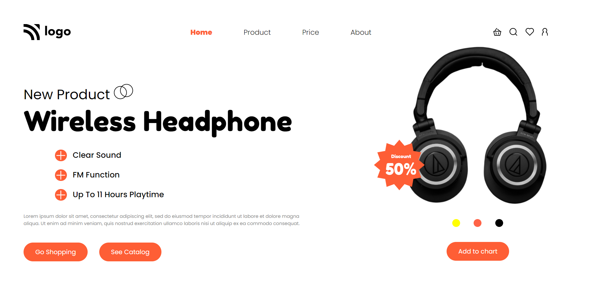

# Product Home Page | 

Hello,

I'm `Ammar Azam Khan`. This is the 7th assignment in my `Full Stack Javascript Bootcamp`, where I developed this website. This website is not responsive.

The Home page contains:

- Navbar
- Product Info Section
- Product Image Section

## 🛠 Technologies Used

&emsp; &ensp;  

## 💻Check out the link below for a preview.

&emsp; &ensp; `note` This site is not responsive.

&emsp; &ensp; &ensp;[Live Preview](https://product-profile-page.netlify.app)

## 📸 Screenshot

## 📝 My learning from this project

- I learned how to align items with CSS flexbox.
- Learned about CSS Position Property.
- Learned about Text styling and button styling.

## ⌛ Time taken to finish the project

- Approximately `4.5 hours`.
